# github-sandbox

This is my personal GitHub sandbox repository. Most of the content was written in Japanese and  used in the GitHub onboarding (training) which I conducted in the past.

<!-- TOC -->

- [github-sandbox](#github-sandbox)
	- [Git コンセプト](#git-コンセプト)
	- [GitHubリポジトリ設定](#githubリポジトリ設定)
	- [git 初期設定](#git-初期設定)
		- [git config](#git-config)
		- [git alias](#git-alias)
	- [プルリクエスト経由でリモートmainにマージ](#プルリクエスト経由でリモートmainにマージ)
		- [git clone](#git-clone)
		- [git branch](#git-branch)
		- [git status](#git-status)
		- [git add](#git-add)
		- [git commit](#git-commit)
			- [Add Signed-off-by message](#add-signed-off-by-message)
		- [git log](#git-log)
		- [git push](#git-push)
	- [merge and rebaseの理解](#merge-and-rebaseの理解)
		- [merge and rebaseの基本](#merge-and-rebaseの基本)
		- [補足 merge: fast-forward (ff)と non fast-forward(no-ff)の違い](#補足-merge-fast-forward-ffと-non-fast-forwardno-ffの違い)
		- [テストデータ準備](#テストデータ準備)
		- [mergeしてみる(conflictあり)](#mergeしてみるconflictあり)
		- [rebaseしてみる(conflictあり)](#rebaseしてみるconflictあり)
		- [補足 conflict解消のための取り込みパターン](#補足-conflict解消のための取り込みパターン)
	- [Conflict解消](#conflict解消)
	- [Undo and Change Commit](#undo-and-change-commit)
		- [commitを打ち消しの基本](#commitを打ち消しの基本)
		- [テストデータを準備する](#テストデータを準備する)
		- [commitを打ち消す](#commitを打ち消す)
		- [commit logを書き換える](#commit-logを書き換える)
	- [Update Commit Message](#update-commit-message)
		- [直前のCommitメッセージを修正](#直前のcommitメッセージを修正)
		- [3つ前のCommitメッセージを修正](#3つ前のcommitメッセージを修正)
	- [Squash merge](#squash-merge)
		- [Squash mergeの基本](#squash-mergeの基本)
		- [テストデータを準備する](#テストデータを準備する-1)
		- [squash mergeする](#squash-mergeする)
		- [ただのmerge (fast-forward merge)](#ただのmerge-fast-forward-merge)
		- [PRをSquash mergeする](#prをsquash-mergeする)
	- [Undo/取り消しパターン(revert, reset, merge --abort,etc)](#undo取り消しパターンrevert-reset-merge---abortetc)
		- [Undoの基本](#undoの基本)
			- [git merge --abort](#git-merge---abort)
			- [git reset commitID](#git-reset-commitid)
			- [git revert commitID](#git-revert-commitid)
		- [テスト準備](#テスト準備)
		- [Undoテスト1: マージ成功後に元に戻す(git reset)](#undoテスト1-マージ成功後に元に戻すgit-reset)
		- [Undoテスト2: マージ成功後に元に戻す(git revert)](#undoテスト2-マージ成功後に元に戻すgit-revert)
		- [Undoテスト3: コンフリクトでマージ失敗(マージ未完了)(git merge --abort)](#undoテスト3-コンフリクトでマージ失敗マージ未完了git-merge---abort)
		- [Undoテスト4: コンフリクトでマージ失敗（マージ未完了）(git reset)](#undoテスト4-コンフリクトでマージ失敗マージ未完了git-reset)
	- [cherry-pick](#cherry-pick)
		- [cherry-pickの基本](#cherry-pickの基本)
		- [絵で比較するmerge vs cherry-pick](#絵で比較するmerge-vs-cherry-pick)
		- [git merge commit2](#git-merge-commit2)
		- [git cherry-pick commit4](#git-cherry-pick-commit4)
		- [git cherry-pick commit5 commit6 commit7](#git-cherry-pick-commit5-commit6-commit7)
		- [テスト準備](#テスト準備-1)
		- [git mergeテスト (cherry-pickとの動きの比較のための実施)](#git-mergeテスト-cherry-pickとの動きの比較のための実施)
		- [git cherry-pick テスト](#git-cherry-pick-テスト)
		- [GitHubで演習](#githubで演習)
	- [Subtree](#subtree)
		- [add subtree](#add-subtree)
		- [pull subtree](#pull-subtree)

<!-- /TOC -->

## Git コンセプト

Gitはスナップショットの集合であり、差分ではない
  - Git: データは一連のスナップショット
  - CVS、Subversion、Perforce、Bazaar: 差分リスト

Gitの基本ワークフロー
  1. 作業ディレクトリのファイルを修正する
  2. 修正されたファイル(`modified`)のスナップショットをステージング・エリアに追加(`git add`)
  3. コミットする(`git commit`)

Gitプロジェクトの3つの主要な部分
- `作業ディレクトリ(working dirs)`: プロジェクトの1つのバージョンがチェックアウトされたもの。Gitディレクトリの圧縮されたデータベースから引き出されてディスクに配置。自分たちが直接編集するのはここ。
- `ステージング・エリア (stage / index)`: 次のコミットに何が含まれるかに関しての情報を蓄えた1つのファイル。「インデックス」とも呼ばれる。実体は`.git/index`
- `Gitディレクトリ(.git)`: プロジェクトのメタデータとオブジェクトのデータベース。リポジトリをクローンしたときにコピーされる

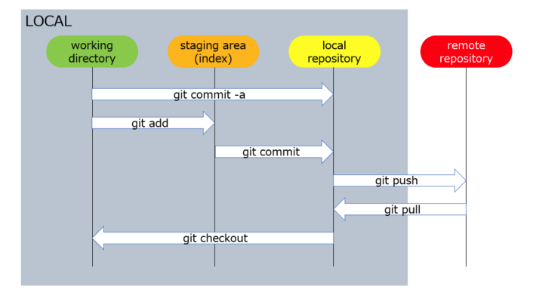

HEAD / Stage(index) / Working directory

-  `HEAD`: the last commit in the currently checked-out branch
-  `Stage(index)`: Staging area, stage, index, cacheはすべて同じ
-  `working directory (working tree)`


ref: [How do I show the changes which have been staged?](https://stackoverflow.com/questions/1587846/how-do-i-show-the-changes-which-have-been-staged)

ファイルの3つのステータス
  - `Commited` コミット済: ローカル・データベースにデータが安全に格納されていること
  - `Modified` 修正済 
  - `Staged` ステージ済: 現在のバージョンの修正されたファイルに印をつけている状態

追跡されているとは？= 直近のスナップショットに存在していること
- `untracked`: 追跡されてない
- `tracked`: 追跡されている
  - `unmodified`: 修正されていない
  - `modified`: 修正済み
  - `staged`: ステージ済み = ステージングエリアにも存在する

local / origin / upstreamの概念

- `upstream`: original repo. もしForkしているならば、Fork元のrepoがupstream
- `origin`:  your own repo on GitHub


ref: [What is the difference between origin and upstream on GitHub?](https://stackoverflow.com/questions/9257533/what-is-the-difference-between-origin-and-upstream-on-github)


参照ページ
- [Gitの基本 - 1.3 使い始める](https://git-scm.com/book/ja/v2/%E4%BD%BF%E3%81%84%E5%A7%8B%E3%82%81%E3%82%8B-Git%E3%81%AE%E5%9F%BA%E6%9C%AC)
- [Gitの基本 - 変更内容のリポジトリへの記録](https://git-scm.com/book/ja/v2/Git-%E3%81%AE%E5%9F%BA%E6%9C%AC-%E5%A4%89%E6%9B%B4%E5%86%85%E5%AE%B9%E3%81%AE%E3%83%AA%E3%83%9D%E3%82%B8%E3%83%88%E3%83%AA%E3%81%B8%E3%81%AE%E8%A8%98%E9%8C%B2)
- [How do I show the changes which have been staged?](https://stackoverflow.com/questions/1587846/how-do-i-show-the-changes-which-have-been-staged)
- [What is the difference between origin and upstream on GitHub?](https://stackoverflow.com/questions/9257533/what-is-the-difference-between-origin-and-upstream-on-github)


Gitの内部構造 (ここでは扱わない)
- [Gitの内側 - Gitオブジェクト](http://git-scm.com/book/ja/v2/Git%E3%81%AE%E5%86%85%E5%81%B4-Git%E3%82%AA%E3%83%96%E3%82%B8%E3%82%A7%E3%82%AF%E3%83%88)
- [Gitの内側 - Gitの参照](http://git-scm.com/book/ja/v2/Git%E3%81%AE%E5%86%85%E5%81%B4-Git%E3%81%AE%E5%8F%82%E7%85%A7)
- [Gitのインデックスの中身](https://zenn.dev/kaityo256/articles/inside_the_index)

## GitHubリポジトリ設定

0 Pre-Requisites

- GitHub Account
- [テスト用 Repo](https://github.com/yokawasa/monorepo-sandbox)への Collaborator権限（Collaborator出ない場合はForkからのPRマージ）

1 `main`ブランチのマージを レビューを必須にする

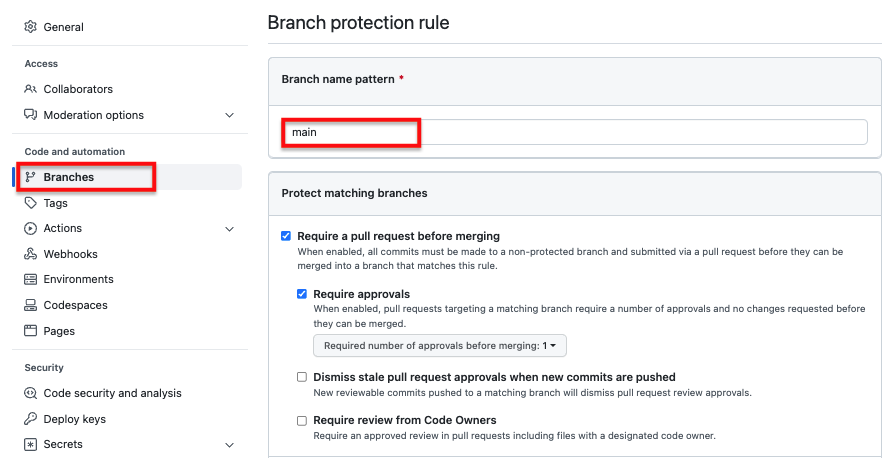

2 管理者も対象 (`main`ブランチのマージを PRレビュー必須) 

`Include administrators` にチェックを入れる

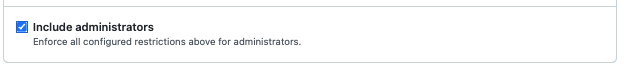

ref: [ブランチ保護ルール](https://docs.github.com/ja/repositories/configuring-branches-and-merges-in-your-repository/defining-the-mergeability-of-pull-requests/managing-a-branch-protection-rule)


## git 初期設定

### git config

ローカルリポジトリ用のユーザー情報設定を行う

設定内容の確認

```bash
git config -l

user.name=yokawasa
user.email=yokawasa@gmail.com
...
```

`user.name`と`user.address`を設定する。`--global`オプションでglobalレベルの設定であることを指定。一方、`--local`でリポジトリレベルの設定が可能。

```bash
#  git config --global user.name "[name]"
git config --global user.name "Yoichi Kawasaki"

# git config --global user.email "[email address]"
git config --global user.name "yokawasa@gmail.com"
```

再び、設定を確認

```bash
git config -l

user.name=Yoichi Kawasaki
user.email=yokawasa@gmail.com
```

なお、この設定は `~/.gitconfig`に保存される

```bash
 cat ~/.gitconfig

...
[user]
  name = Yoichi Kawasaki
  email = yokawasa@gmail.com
```

その他git config設定については
- [Attlassian Gitチュートリアル git config](https://www.atlassian.com/ja/git/tutorials/setting-up-a-repository/git-config)

### git alias

Gitエイリアスの設定。checkoutにたいしてco、commitに対してciのエイリアスを作成する

```
git config --global alias.co checkout
git config --global alias.ci commit
```

なお、この設定は `~/.gitconfig`に保存される

```bash
 cat ~/.gitconfig

...
[alias]
  co = checkout
  ci = commit
```

作成したエイリアスco (=checkout)を使う

```
# hogeブランチにスイッチ
git co hoge
```

その他git alias設定については
- [Attlassian Gitチュートリアル git config](https://www.atlassian.com/ja/git/tutorials/setting-up-a-repository/git-config)


> Note: git sandboxで使用するgit config, alias設定
> ```
> # ff merge false
> git config --global --add merge.ff false
> # ff merge in pull
> git config --global --add pull.ff only
> 
> # git log graph pretty format表示
> git config --global alias.l "log --graph --all --pretty=format:'%C(yellow)%h%C(cyan)%d%Creset %s %C(white)- %an, %ar%Creset'"
> 
> ```

## プルリクエスト経由でリモートmainにマージ

> **NOTE**
> - mainへの直push絶対にやらない  (一般的にはブランチ保護ルールを適用してmain直pushをブロックする)
> - 作業用ブランチを切って作業する
### git clone 

テスト用リポジトリをgit cloneしてディレクトリを移動

```
git clone git@github.com:yokawasa/monorepo-sandbox.git
cd monorepo-sandbox
```

### git branch

作業用ブランチを作成

```
# git checkout -b <作成する作業用ブランチ>
git checkout -b my-branch1
```

ブランチ一覧を表示。今がmy-branch1にいることがわかる

```
git branch 

  main
* my-branch1
```

mainブランチに移動

```
# git checkout <branch名>
git checkout main
```

my-branch1ブランチを削除

```
# git branch -d <branch名>
git branch my-branch1
```

ブランチ一覧を表示。my-branch1が消えていることを確認

```
git branch 
*  main
```

最後に、再び作業用ブランチmy-branch2を作成する

```bash
git checkout -b my-branch2
```

追加：リモートブランチの削除

```
git push --delete origin branch_name
```
ref: https://qiita.com/yuu_ta/items/519ea47ac2c1ded032d9


### git status

`git status`はstaged, unstaged, untrackedな状態のファイルを一覧表示するコマンド。

まずは、tools/service/svc-a配下にtest.shファイルを作成する。

```
cp -p tools/service/svc-a/svc-a.sh tools/service/svc-a/test.sh 
```

次に、`git status`でGitファイルの状態を確認する。test.shが`Untracked`であることがわかる

```
git status

On branch my-branch2
Untracked files:
  (use "git add <file>..." to include in what will be committed)
        tools/service/svc-a/test.sh

nothing added to commit but untracked files present (use "git add" to track)
```

### git add

`git add`は変更されたファイルをステージエリア（インデックス）に追加する。
さきほど追加されたtest.shをステージエリア（インデックス）に追加する。

```bash
git add tools/service/svc-a/test.sh 
```

`git status`でファイルの状態を確認する。test.shがステージエリアにある（= Changes to be committed）ことがわかる。

```
git status

On branch my-branch2
Changes to be committed:
  (use "git restore --staged <file>..." to unstage)
        new file:   tools/service/svc-a/test.sh
```

### git commit

`git commit`でァイルをCommitedステータスに変更。`-m`オプションで追加メッセージを指定可能。`-m`ない場合はeditが立ち上がり、メッセージの入力が可能

```bash
git commit -m "updated"
```

#### Add Signed-off-by message

よくOSSでsign-off-byをつけたメッセージが求められるプロジェクトがある。
たとえばこちらのプロジェクト → [Developer Certificate of Origin in KEDA](https://github.com/kedacore/keda/blob/main/CONTRIBUTING.md#developer-certificate-of-origin-signing-your-work)

`git commit`に`-s` | `--signoff`オプションを追加することでcommitメッセージにsign-off-byを付与できる。

```
git commit -s -m 'This is my commit message'

git log

Author: Yoichi Kawasaki <yokawasa@gmail.com>
Date:   Thu Jun 2 22:43:23 2022 +0900

    This is my commit message
    
    Signed-off-by: Yoichi Kawasaki <yokawasa@gmail.com> <<<<<< これ
```

なお、sign-off-byメッセージは通常メッセージと同じように`--amend`オプションで修正することが可能

```
git commit --amend -s
```

デフォルトでコミットメッセージにsign-offを付与する方法ついてはこちらの[議論](https://stackoverflow.com/questions/15015894/git-add-signed-off-by-line-using-format-signoff-not-working)が参考になる。

また、commit message templateを利用してももよいかもしれない。

```
Signed-off-by: Your Name <your.email@example.com>
```

これを次のようにcommit templateとして設定する

```
git config --global commit.template ~/MYPROJECT/git-template
```
### git log

Gitのログの履歴を確認する

```
git log

commit c835e6bd662005d96467ac60a3312a725796248f (HEAD -> my-branch2, main)
Author: Yoichi Kawasaki <yokawasa@gmail.com>
Date:   Tue Jun 7 13:39:50 2022 +0900

    remove space

commit 5c11f7c1187d7d53749dd91b4d3eb7bfca38d020 (origin/main, origin/HEAD)
Author: Yoichi Kawasaki <yokawasa@gmail.com>
Date:   Tue Jun 7 13:37:10 2022 +0900

    add space

commit be9518e5377500cb3f1424df69a90ad959e7e98b
Merge: a8cd49a 02791c2
Author: Yoichi Kawasaki <yokawasa@gmail.com>
Date:   Tue Jun 7 12:59:02 2022 +0900

    Merge pull request #1 from yokawasa/init-entry
    
    add initial files
```

### git push

remoteリポジトリにpush


## merge and rebaseの理解

### merge and rebaseの基本

mergeもrebaseも目的は１つ: 変更を１つのブランチから別のブランチに統合。ただしアプローチが異なる

最初の状態

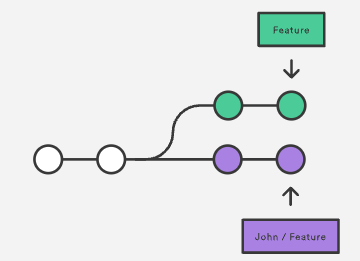

mergeは？
- 変更を１つのブランチから別のブランチに統合。分岐したブランチのコミットをとってこない
- fast-forwardとnon-fast-forwardによりmergeコミットが生成を区別
  - fast-forward merge(--ff): マージコミットは作られず、ブランチの参照先の更新だけが更新される
  - non fast-forward merge (--no-ff) マージ : 意図的にfast-forwardを行わないコミット。マージコミットが作られる  

```
git merge <commit/branch>
git merge --ff <branch>
git merge --no-ff <branch>
git merge <branch> -m "コミットメッセージの内容"
```

merge後の状態
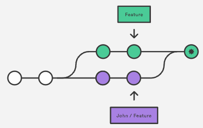


rebaseは?
- コミット履歴を移動したり修正、削除したりするコマンド
- マージ前にコミット履歴をきれいにする目的で使用される事が多い (git rebaseしてからPR出す)
- 分岐した時点からのコミット内容をとってきて、自分の変更後のコミットをその先端に移動する。取得してきたコミット番号は変わらないが、自分のブランチのコミットは変更される（過去のコミット履歴が変わるため）

```
git rebase <base>   # base = commit, branch, tag, etc.
```

rebase後の状態
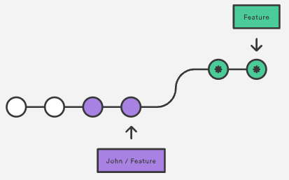

ref: https://www.atlassian.com/git/tutorials/merging-vs-rebasing

### 補足 merge: fast-forward (ff)と non fast-forward(no-ff)の違い

- fast-forwardマージ (--ff): マージコミットは作られず、ブランチの参照先の更新だけが更新される
- non fast-forwardマージ (--no-ff) マージ : 意図的にfast-forwardを行わないコミット。マージコミットが作られる  

merge commitがあると以下の点で便利。
- merge commitのdiffを見るだけでそのブランチで行われた作業を見るのが容易
- merge commitを取り消すことでmerge作業自体をなかったことにしたい場合も簡単

逆にmerge commitが作られないと、 mainがその後更新されていった場合にfeatureブランチで行われた作業を参照するのが面倒になる。また、mergeの取り消しを行いたいと思った場合にもかなり不便。よって、no-ffでmergeするのがよい。強制的にmergeでno-ffにするならば、次の設定をいれるとよい。

```
git config --global --add merge.ff false
```

[注意] ただしpullを行った時に行われるmergeにも--no-ffが有効になるため、pullを行う度にmergeコミットが発行されてコミットログが荒れる。なので、pullのときは除外したい。その場合は次の設定をいれるとよい。

```
git config --global --add pull.ff only
```

まとめると、次の設定をいれておくとよい
```
git config --global --add merge.ff false
git config --global --add pull.ff only
```

ref: 
- [gitのmerge --no-ff のススメ](https://qiita.com/nog/items/c79469afbf3e632f10a1)
- [A successful Git branching model (日本語訳)](http://keijinsonyaban.blogspot.com/2010/10/a-successful-git-branching-model.html)

### テストデータ準備

```
git checkout main
touch test.md
echo "add c0" >> test.md && git add test.md && git commit -m "c0"
echo "add c1" >> test.md && git add test.md && git commit -m "c1"
echo "add c2" >> test.md && git add test.md && git commit -m "c2"

git checkout -b myfeature
echo "add c3" >> test.md && git add test.md && git commit -m "c3"
echo "add c4" >> test.md && git add test.md && git commit -m "c4"

git checkout main
echo "add c5" >> test.md && git add test.md && git commit -m "c5"
```

### mergeしてみる(conflictあり)

conflictありmergeの場合は、fast-forward or not fast-forward どちらでもmerge commitが作られる。

myfeatureブランチに移動して、mainブランチをmergeする

```bash
# myfeatureブランチに移動
git checkout myfeature

# git log表示
git l

* bb5ca52 (main) c5 - Yoichi Kawasaki, 8 minutes ago
| * 49fd048 (HEAD -> myfeature) c4 - Yoichi Kawasaki, 9 minutes ago
| * 9bc41fb c3 - Yoichi Kawasaki, 10 minutes ago
|/  
* 623ce75 c2 - Yoichi Kawasaki, 11 minutes ago
* 43c5fd6 c1 - Yoichi Kawasaki, 11 minutes ago
* 7cb76e3 c0 - Yoichi Kawasaki, 12 minutes ago

# mainブランチをmergeする
git merge main

# 下記のようなConflictメッセージが出力される
Auto-merging test.md
CONFLICT (content): Merge conflict in test.md
Automatic merge failed; fix conflicts and then commit the result.

# 手動でConflictを解消してtest.mdをcommitする
vi test.md
git add test.md
git commit -m "fix conflict"

# merge後のgit log表示
git l

*   d22507e (HEAD -> myfeature) fix conflict - Yoichi Kawasaki, 3 seconds ago
|\  
| * bb5ca52 (main) c5 - Yoichi Kawasaki, 6 minutes ago
* | 49fd048 c4 - Yoichi Kawasaki, 7 minutes ago
* | 9bc41fb c3 - Yoichi Kawasaki, 7 minutes ago
|/  
* 623ce75 c2 - Yoichi Kawasaki, 8 minutes ago
* 43c5fd6 c1 - Yoichi Kawasaki, 9 minutes ago
* 7cb76e3 c0 - Yoichi Kawasaki, 9 minutes ago
```

最後に、次の処理のために今回のmerge commitをなかったコトにする
```
# 直前のコミットを取り消しする
git reset --hard HEAD^
```

### rebaseしてみる(conflictあり)

myfeatureブランチに移動して、mainブランチをrebaseする

```bash
# myfeatureブランチに移動
git checkout myfeature

# git log表示
git l

# mainブランチをrebaseする
git rebase main

# conflict発生
First, rewinding head to replay your work on top of it...
Applying: c3
Using index info to reconstruct a base tree...
M       test.md
Falling back to patching base and 3-way merge...
Auto-merging test.md
CONFLICT (content): Merge conflict in test.md
error: Failed to merge in the changes.
Patch failed at 0001 c3
hint: Use 'git am --show-current-patch' to see the failed patch
Resolve all conflicts manually, mark them as resolved with
"git add/rm <conflicted_files>", then run "git rebase --continue".
You can instead skip this commit: run "git rebase --skip".
To abort and get back to the state before "git rebase", run "git rebase --abort".

# 手動でconflictを修復して git add して git rebase --continueする。これをauto-mergeが成功するまでやる
vi test.md
git add test.md
git rebase --continue

# rebase後のgit log表示
git l

* 68ef496 (HEAD -> myfeature) c4 - Yoichi Kawasaki, 13 minutes ago
* e90fd40 c3 - Yoichi Kawasaki, 14 minutes ago
* bb5ca52 (main) c5 - Yoichi Kawasaki, 12 minutes ago
* 623ce75 c2 - Yoichi Kawasaki, 15 minutes ago
* 43c5fd6 c1 - Yoichi Kawasaki, 15 minutes ago
* 7cb76e3 c0 - Yoichi Kawasaki, 16 minutes ago
```


### 補足 conflict解消のための取り込みパターン

`=======`より上がHEAD (Current Change)、下が取り込む変更 (Incoming Change)。

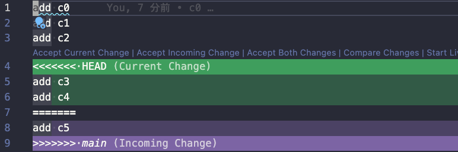

VS Codeの場合、以下の３つのオプションから取り込み方を選択できる機能あり
- Accept Current Change
- Accept Incoming Change
- Accept Both Change


## Conflict解消

 TBU

> git pull
```
git checkout myfeature

git pull origin main
= 
git fetch origin main
git merge origin/main
```

## Undo and Change Commit

### commitを打ち消しの基本

git revert に打ち消したい`commit-id`を指定する

```
# コミット打ち消し ＋「Revert + <元のコミットのメッセージ>」なコミット作成
git revert  <commit-id>

# コミット打ち消し ＋「任意のメッセージ」なコミット作成
git revert -e <commit-id>

# コミット打ち消し（コミットは作成しない）
git revert  -n <commit-id>

# マージコミットをうち消し (-m オプションなしでマージコミットをrevertするとエラーが出る)
git revert -m <parent-number>  <commit-id>
# parent-number = 1 (1つ目の親) or 2 (2つ目の親)
# git show <commit-id>で下記のような結果が表示された場合, eaa9618 -> 1, cddcef9->2となる
# git show <commit-id>
# ---
# git show 9c8582d
#   commit 9c8582de1c2446a29b7f451d00eff0f71c0ebc3d (HEAD -> merge-branch, origin/merge-branch)
#.  Merge: eaa9618 cddcef9
# ---
```

### テストデータを準備する

次のようにrevert-testブランチに移動してテストコミットをする

```
git checkout -b revert-test

touch revert.md

echo "add c0" >> revert.md && git add revert.md && git commit -m "c0"
echo "add c1" >> revert.md && git add revert.md && git commit -m "c1"
echo "add c2" >> revert.md && git add revert.md && git commit -m "c2"
echo "add c3" >> revert.md && git add revert.md && git commit -m "c3"
```

### commitを打ち消す

ファイル内容を確認

```
cat revert.md

add c0
add c1
add c2
add c3
```

コミットログを確認
```
git l

* 3dd91e1 (HEAD -> revert-test) c3 - Yoichi Kawasaki, 54 seconds ago
* 0cf6f21 c2 - Yoichi Kawasaki, 57 seconds ago
* 7223760 c1 - Yoichi Kawasaki, 61 seconds ago
* 9591f87 c0 - Yoichi Kawasaki, 66 seconds ago
```

ここでc3 (commit id: `3dd91e1` )のコミットを打ち消す

```
git revert -e 3dd91e1
```

コミットメッセージを作成後、ファイル内容とログを確認。c3のコミットが打ち消されていることがわかる

```
cat revert.md

add c0
add c1
add c2

git l 

* 9150f70 (HEAD -> revert-test) Revert "c3" - Yoichi Kawasaki, 2 minutes ago
* 3dd91e1 c3 - Yoichi Kawasaki, 7 minutes ago
* 0cf6f21 c2 - Yoichi Kawasaki, 7 minutes ago
* 7223760 c1 - Yoichi Kawasaki, 7 minutes ago
* 9591f87 c0 - Yoichi Kawasaki, 7 minutes ago
```
 
次に、さらにrevert commit (`9150f70`) をrevertしてみる

```
git revert 9150f70
```

コミットメッセージを作成後、ファイル内容とログを確認。c3の打ち消しこみっとが打ち消されていることがわかる
```
cat revert.md

add c0
add c1
add c2
add c3

git l

* 124421f (HEAD -> revert-test) Revert "Revert "c3"" - Yoichi Kawasaki, 86 seconds ago
* 9150f70 Revert "c3" - Yoichi Kawasaki, 5 minutes ago
* 3dd91e1 c3 - Yoichi Kawasaki, 10 minutes ago
* 0cf6f21 c2 - Yoichi Kawasaki, 10 minutes ago
* 7223760 c1 - Yoichi Kawasaki, 10 minutes ago
* 9591f87 c0 - Yoichi Kawasaki, 10 minutes ago
```

### commit logを書き換える

```
git rebase -i <書き換えたい1つ前のcommit id>

command の内容
----------------------------------------------------------------
# Commands:
# p, pick <commit> = use commit
# r, reword <commit> = use commit, but edit the commit message
# e, edit <commit> = use commit, but stop for amending
# s, squash <commit> = use commit, but meld into previous commit
# f, fixup <commit> = like "squash", but discard this commit's log message
# x, exec <command> = run command (the rest of the line) using shell
# b, break = stop here (continue rebase later with 'git rebase --continue')
# d, drop <commit> = remove commit
# l, label <label> = label current HEAD with a name
# t, reset <label> = reset HEAD to a label
# m, merge [-C <commit> | -c <commit>] <label> [# <oneline>]
# .       create a merge commit using the original merge commit's
# .       message (or the oneline, if no original merge commit was
# .       specified). Use -c <commit> to reword the commit message.
```


たとえば、revertログを書き換え（ここではdrop）たい場合、`124421f`、`9150f70`より前の`3dd91e1`でrebaseする

```
git rebase -i 3dd91e1
```
すると次のような編集モードでメッセージが表示される

```
pick 9150f70 Revert "c3"
pick 124421f Revert "Revert "c3"
```

これを次のようにpickからdropに変更して保存して編集モードを終了する。

```
drop 9150f70 Revert "c3"
drop 124421f Revert "Revert "c3"
```

コミットログをみると上記2つのコミットがdropされていることが確認できる

```
git l 

* 3dd91e1 (HEAD -> revert-test) c3 - Yoichi Kawasaki, 16 minutes ago
* 0cf6f21 c2 - Yoichi Kawasaki, 10 minutes ago
* 7223760 c1 - Yoichi Kawasaki, 10 minutes ago
* 9591f87 c0 - Yoichi Kawasaki, 10 minutes ago
```


## Update Commit Message

### 直前のCommitメッセージを修正

```bash
git log 

commit 693b3e407553900af577e9194dd158d59eb19c81 (HEAD -> main)
Author: Yoichi Kawasaki <yokawasa@gmail.com>
Date:   Sat Jun 4 00:15:20 2022 +0900

    Wrong message 
```

No!! You can modify the latest commit message like this:

```
git commit --amend -m "Correct message"

commit 693b3e407553900af577e9194dd158d59eb19c81 (HEAD -> main)
Author: Yoichi Kawasaki <yokawasa@gmail.com>
Date:   Sat Jun 4 00:15:20 2022 +0900

    Correct message 
```

ref: [Fix commit message](https://www.granfairs.com/blog/staff/git-commit-fix)

### 3つ前のCommitメッセージを修正

```
git log --oneline

b7ec5be (HEAD -> master) This is my commit message
ce12a90 This is my commit message
a046ce0 (origin/master, origin/HEAD) Added sqlcheck.yml <<<これを変えたい
```

↑３つ前を変えたい.
一番新しいコミットを1として、修正したいコミットまでの数を数えて、「HEAD~」のあとにその数を入力する。 今回修正したいのは3番目なので「HEAD~3」とする

```
git rebase -i HEAD~3
```

すると次のようなvi edit pageが表示。
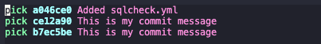

修正したいコミット先頭の「pick」を「edit」に書き換える。

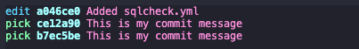

次のコマンドでコメントを修正する

```
git commit --amend 
```


もしくは、単に`-m`オプションを付与してメッセージを更新できる

```
git commit --amend -s -m "Added sqlcheck.yml added message"
```

そして、次のコマンドを入力してrebaseを成功させる。これでmainブランチにスイッチされる。

```
git rebase --continue

Successfully rebased and updated refs/heads/master.
```

メッセージが修正されているかを確認する

```
git log --oneline

6877420 (HEAD -> master) This is my commit message
963cc1f This is my commit message
c49eeb0 Added sqlcheck.yml added message <<<<<<<<<<<<<<< 期待通り変更されている
```

最後にローカルの変更をoriginにpush。このとき `--force`指定がないとpushが失敗して次のようなエラーがでる

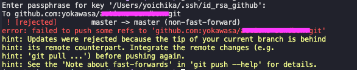

これは、rebaseをしてremote/localで異なるログを持つため、通常はそのままではgit pushできない。
対応としては、`--force | -f`でremoteブランチをローカルのそれによって強制上書きする。

```
git push origin master --force
```


ref:
- [Fix commit message](https://www.granfairs.com/blog/staff/git-commit-fix)
- [git fast-forward mergeについて](https://qiita.com/vsanna/items/451b42f886c599a16a55)

## Squash merge

### Squash mergeの基本
作業用ブランチで細かく粒度を小さくしてコミットしたログを、ある程度まとめてマージしたい場合に`--squash`オプションを活用する。

```
# ある<branch>ブランチの複数コミットをまとめてsquash mergeする
git merge --squash <branch>
```

### テストデータを準備する

ここではsquash-testブランチから、作業用にsquash-test-devブランチを作成してそこで作業を行う（複数コミットする）。その内容をsquash-testブランチにマージするときに 複数コミットログをまとめてsquash mergeする

まずはsquash-testブランチを切って、少し作業をする
```
git checkout -b squash-test

touch squash.md
echo "add c0" >> squash.md && git add squash.md && git commit -m "c0"
echo "add c1" >> squash.md && git add squash.md && git commit -m "c1"
echo "add c2" >> squash.md && git add squash.md && git commit -m "c2"
```
ログをみる
```
git l

* 7c1b5bb (squash-test) c2 - Yoichi Kawasaki, 4 minutes ago
* 3765799 c1 - Yoichi Kawasaki, 4 minutes ago
* 218d089 c0 - Yoichi Kawasaki, 4 minutes ago
```

次に、squash-testブランチから作業用squash-test-devブランチを切って少し作業をする

```
git checkout -b squash-test-dev
echo "add c3" >> squash.md && git add squash.md && git commit -m "c3"
echo "add c4" >> squash.md && git add squash.md && git commit -m "c4"
echo "add c5" >> squash.md && git add squash.md && git commit -m "c5"
```
ログをみる
```
git l
* 01eb340 (HEAD -> squash-test-dev) c5 - Yoichi Kawasaki, 18 seconds ago
* 3feba4b c4 - Yoichi Kawasaki, 47 seconds ago
* f519c72 c3 - Yoichi Kawasaki, 69 seconds ago
* 7c1b5bb (squash-test) c2 - Yoichi Kawasaki, 4 minutes ago
* 3765799 c1 - Yoichi Kawasaki, 4 minutes ago
* 218d089 c0 - Yoichi Kawasaki, 4 minutes ago
```

### squash mergeする
それではsquash-testに移動して、squash-test-devブランチの作業ログ（複数）をsquash-testブランチにsquashマージする

```
# squash-testに移動
git checkout squash-test
# squash merge
git merge --squash squash-test-dev
# 内容をコミットする
git commit -m "merged squash-test-dev"
```

ログを見ると、複数のログがまとまったログとしてマージされていることがわかる

```
git l
* bf67590 (HEAD -> squash-test) merged squash-test-dev - Yoichi Kawasaki, 2 seconds ago
| * 01eb340 (squash-test-dev) c5 - Yoichi Kawasaki, 6 minutes ago
| * 3feba4b c4 - Yoichi Kawasaki, 6 minutes ago
| * f519c72 c3 - Yoichi Kawasaki, 7 minutes ago
|/
* 7c1b5bb c2 - Yoichi Kawasaki, 10 minutes ago
* 3765799 c1 - Yoichi Kawasaki, 10 minutes ago
* 218d089 c0 - Yoichi Kawasaki, 10 minutes ago
```

### ただのmerge (fast-forward merge)

こんどは新たに作業用にsquash-test-dev2を作成して作業する

```
git checkout -b squash-test-dev2
echo "add c6" >> squash.md && git add squash.md && git commit -m "c6"
echo "add c7" >> squash.md && git add squash.md && git commit -m "c7"
echo "add c8" >> squash.md && git add squash.md && git commit -m "c8"
```

それではsquash-testに移動して、squash-test-dev2ブランチの作業ログ（複数）をsquashじゃないモードでマージする（fast-forwardマージ）。

```
git checkout squash-test
git merge squash-test-dev2

Updating bf67590..6f7d160
Fast-forward
 squash.md | 3 +++
 1 file changed, 3 insertions(+)
```

ログをみると、squash-test-dev2の複数コミットログがfast-forwardマージされていることがわかる

```
* 6f7d160 (HEAD -> squash-test, squash-test-dev2) c8 - Yoichi Kawasaki, 7 minutes ago
* fdf770d c7 - Yoichi Kawasaki, 8 minutes ago
* 061a29c c6 - Yoichi Kawasaki, 8 minutes ago
* bf67590 merged squash-test-dev - Yoichi Kawasaki, 22 minutes ago
| * 01eb340 (squash-test-dev) c5 - Yoichi Kawasaki, 27 minutes ago
| * 3feba4b c4 - Yoichi Kawasaki, 28 minutes ago
| * f519c72 c3 - Yoichi Kawasaki, 28 minutes ago
|/
* 7c1b5bb c2 - Yoichi Kawasaki, 31 minutes ago
* 3765799 c1 - Yoichi Kawasaki, 31 minutes ago
* 218d089 c0 - Yoichi Kawasaki, 31 minutes ago
```

### PRをSquash mergeする

PRを作成し、approveされmergeボタンを押すときに以下のイメージのような選択肢がある。デフォルトはただのマージだけど、「Squash and merge」を選択すると、複数のコミットを１つにまとめてマージできる

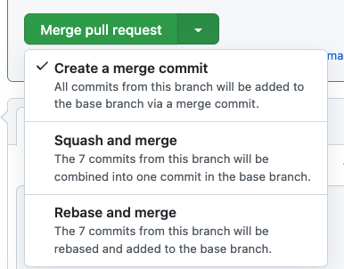

以下 feature ブランチ→mainブランチへのPRでsquashマージしたときとそうでないときのログ履歴の違い

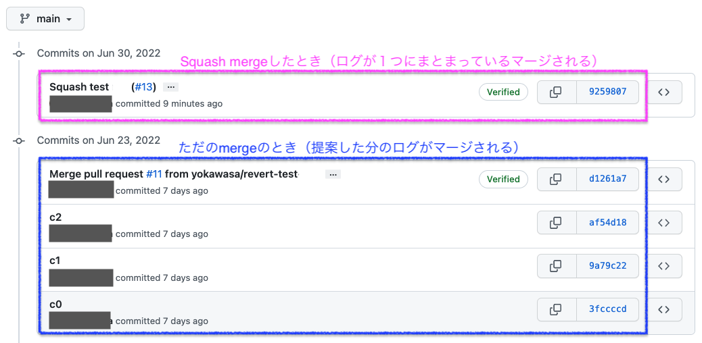


## Undo/取り消しパターン(revert, reset, merge --abort,etc)

### Undoの基本

取り消し(Undo)はrevert, reset, merge --abortで実現可能。これらの違いについてポイントを下記する

#### git merge --abort
- ローカルマージのUndo。コンフリクト発生時などでUndo時に有効
- **マージが完了している場合はUndoできない**
- **コミット履歴: 残らない**

#### git reset commitID
- マージのUndo（リモートもOKだけどローカルUndoを推奨）。指定したコミットまで戻る。マージが完了していてもUndo可。
- **コミット履歴: 消える**
- 2つの使い方が可能
  - 指定したコミットまで戻る: `git reset <commit>`
  - 指定したファイルのみ指定したコミットの状態に戻る:  `git reset <commit> <file-path>`
- 戻す場合どこまで変更中のファイルを残すか指定する3つのオプションが指定可能: `–soft`, `–mixed`,`–hard`。基本的にさっくりと戻すことを期待していることが多いと思うので`--hard`でOK

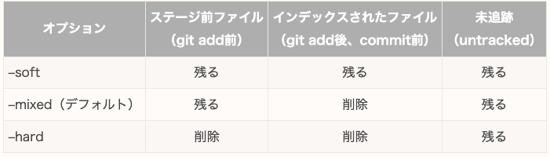

- 定石パターン
  - `git reflog`との組み合わせて過去に戻る
```bash
#コマンド履歴の一覧を確認
git reflog
#コミットを戻す
git reset --hard <commitID>
```
- これを使うのはローカルのみ! 複数人での共同開発レポジトリでは使わないことを推奨
  - コミット履歴は過去のコミットに全て紐づいているので過去のコミット履歴が変わると、その後のコミットのコミット番号も変わる。よって、git resetでコミットを戻してリモートレポジトリにプッシュしてしまうと、他の人たちのコミット履歴とズレてエラーが発生する。迷惑＆嫌がられる

#### git revert commitID
- マージのUndo（リモートでもOK）
- **コミット履歴: 残る**
- 使い方
  - 指定したマージ（commitID）のUndo :  `git revert <commitID>`
  - マージコミットUndo:  `git revert -m [1|2] <commitID>`    (パターン番号: 1 - 現在のブランチ, 2- 派生ブランチ)
  - リバートの打ち消し(revertコマンドを未実行状態に戻す): `git revert --abort`
-  共同開発レポジトリではこちらを使うことを推奨（コミット履歴に残るから）

### テスト準備
mainブランチからmerge-test-devを作成して、テスト用コミット(c0〜c4)を実行
```bash
git checkout main
git checkout -b merge-test-dev

echo "add c0" >> merge.md && git add merge.md && git commit -m "c0"
echo "add c1" >> merge.md && git add merge.md && git commit -m "c1"
echo "add c2" >> merge.md && git add merge.md && git commit -m "c2"
echo "add c3" >> merge.md && git add merge.md && git commit -m "c3"
echo "add c4" >> merge.md && git add merge.md && git commit -m "c4"
```

mainブランチに戻り、mainブランチから`merge-test-main`ブランチを作成

```bash
git checkout main
git checkout -b merge-test-main

git l
* a9ae509 (merge-test-dev) c4 - Yoichi Kawasaki, 3 minutes ago
* 184c432 c3 - Yoichi Kawasaki, 3 minutes ago
* a31d620 c2 - Yoichi Kawasaki, 3 minutes ago
* b60231c c1 - Yoichi Kawasaki, 3 minutes ago
* fa26181 c0 - Yoichi Kawasaki, 3 minutes ago
* 3cc58f0 (HEAD -> merge-test-main, main) update - Yoichi Kawasaki, 3 hours ago
```

### Undoテスト1: マージ成功後に元に戻す(git reset)

`merge-test-main`ブランチにて、コミットc0をmergeする

```bash
git merge fa26181    # fa26181 = c0 commit ID

# merge.mdファイルチェック
cat merge.md
add c0

# ログチェック
git l 
* a9ae509 (merge-test-dev) c4 - Yoichi Kawasaki, 6 minutes ago
* 184c432 c3 - Yoichi Kawasaki, 6 minutes ago
* a31d620 c2 - Yoichi Kawasaki, 6 minutes ago
* b60231c c1 - Yoichi Kawasaki, 6 minutes ago
* fa26181 (HEAD -> merge-test-main) c0 - Yoichi Kawasaki, 6 minutes ago
```

次に、コミットc1をmergeしてみる

```bash
git merge b60231c     # b60231c = c1 commit ID

# merge.mdファイルチェック
cat merge.md
add c0
add c1
```

さらに、コミットc3をmergeしてみる
```
git merge 184c432  # 184c432 = c3 commit ID (この場合、c3とその親にあたるc2 .. もマージされる)

# merge.mdファイルチェック
cat merge.md
add c0
add c1
add c2
add c3
```

次に、`git reset`で コミットc3のmergeを取り消して、c1 mergeの時点まで戻る

```bash
# コマンド履歴をみる
git reflog

184c432 (HEAD -> merge-test-main) HEAD@{0}: merge 184c432: Fast-forward
b60231c HEAD@{1}: merge b60231c: Fast-forward
fa26181 HEAD@{2}: merge fa26181: Fast-forward
3cc58f0 (main) HEAD@{3}: checkout: moving from main to merge-test-main

# コミットc1 b60231cのところまで戻る
git reset --hard b60231c
git l
* a9ae509 (merge-test-dev) c4 - Yoichi Kawasaki, 14 minutes ago
* 184c432 c3 - Yoichi Kawasaki, 14 minutes ago
* a31d620 c2 - Yoichi Kawasaki, 15 minutes ago
* b60231c (HEAD -> merge-test-main) c1 - Yoichi Kawasaki, 15 minutes ago
* fa26181 c0 - Yoichi Kawasaki, 15 minutes ago

# merge.mdファイルチェックして、コミットc1のところまで戻っていることを確認
cat merge.md
add c0
add c1
```

### Undoテスト2: マージ成功後に元に戻す(git revert)

次に、再びコミットc3をmergeする

```
git merge 184c432     # 184c432 = c3 commit ID (この場合、c3とその親にあたるc2 .. もマージされる)

# merge.mdファイルをチェックしてコミットc3がマージされていることを確認
cat merge.md
add c0
add c1
add c2
add c3

# ログをみる
git l
* a9ae509 (merge-test-dev) c4 - Yoichi Kawasaki, 71 minutes ago
* 184c432 (HEAD -> merge-test-main) c3 - Yoichi Kawasaki, 71 minutes ago
* a31d620 c2 - Yoichi Kawasaki, 72 minutes ago
* b60231c c1 - Yoichi Kawasaki, 72 minutes ago
* fa26181 c0 - Yoichi Kawasaki, 72 minutes ago
```

次に、`git revert`で コミットc3のmergeを取り消して、コミットc2 mergeの時点まで戻る

```bash
git revert 184c432   # コミットc3をRevert
```

次のようなeditぺーじに遷移するが、メッセージを書いて保存するとrevert完了

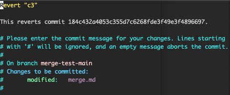

ログをみると次のようにrevertログが残っていることがわかる（一方 git resetでは取り消しログが残っていない）

```bash
git l 

* 69f5860 (HEAD -> merge-test-main) Revert "c3" - Yoichi Kawasaki, 2 minutes ago
| * a9ae509 (merge-test-dev) c4 - Yoichi Kawasaki, 76 minutes ago
|/
* 184c432 c3 - Yoichi Kawasaki, 76 minutes ago
* a31d620 c2 - Yoichi Kawasaki, 76 minutes ago
* b60231c c1 - Yoichi Kawasaki, 76 minutes ago
* fa26181 c0 - Yoichi Kawasaki, 76 minutes ago
```

### Undoテスト3: コンフリクトでマージ失敗(マージ未完了)(git merge --abort)

まずはテスト c1まで戻す

```bash
# コミットc1 b60231cのところまで戻る
git reset --hard b60231c
git l
* a9ae509 (merge-test-dev) c4 - Yoichi Kawasaki, 14 minutes ago
* 184c432 c3 - Yoichi Kawasaki, 14 minutes ago
* a31d620 c2 - Yoichi Kawasaki, 15 minutes ago
* b60231c (HEAD -> merge-test-main) c1 - Yoichi Kawasaki, 15 minutes ago
* fa26181 c0 - Yoichi Kawasaki, 15 minutes ago
```

次に、merge.mdを編集してコミットc5を追加する

```bash
echo "add c5" >> merge.md && git add merge.md && git commit -m "c5"

# merge.mdを確認する
cat merge.md
add c0
add c1
add c5

# ログをみる
git l
* 2d669b9 (HEAD -> merge-test-main) c5 - Yoichi Kawasaki, 15 seconds ago
| * a9ae509 (merge-test-dev) c4 - Yoichi Kawasaki, 16 minutes ago
| * 184c432 c3 - Yoichi Kawasaki, 16 minutes ago
| * a31d620 c2 - Yoichi Kawasaki, 16 minutes ago
|/
* b60231c c1 - Yoichi Kawasaki, 16 minutes ago
* fa26181 c0 - Yoichi Kawasaki, 16 minutes ago
```

次に、コミットc3をmergeする。すると、次のようにコンフリクトが発生する

```bash
git merge 184c432  #  184c432  = コミットc3のID 

Auto-merging merge.md
CONFLICT (content): Merge conflict in merge.md
Automatic merge failed; fix conflicts and then commit the result.

# merge.mdを見るとコンフリクトが確認できる
cat merge.md
add c0
add c1
<<<<<<< HEAD
add c5
=======
add c2
add c3
>>>>>>> 184c432
```

この状態を元に戻したい。ここでは `git merge --abort`を使う

```bash
git merge --abort

# merge.mdをみて無事戻っていることを確認
cat merge.md
add c0
add c1
add c5
```

### Undoテスト4: コンフリクトでマージ失敗（マージ未完了）(git reset)

再びコミットc3をmergeしてみて、意図的にコンフリクトを発生させる

```bash

git merge 184c432   #  184c432  = コミットc3のID 
Auto-merging merge.md
CONFLICT (content): Merge conflict in merge.md
Automatic merge failed; fix conflicts and then commit the result.

```
あとは、さきほどのgit reset のときと同じように git reflogして git resetで戻すcommitIDを指定する

```bash
git reflog
2d669b9 (HEAD -> merge-test-main) HEAD@{1}: reset: moving to HEAD
2d669b9 (HEAD -> merge-test-main) HEAD@{2}: commit: c5

git reset --hard 2d669b9
# or 
# git reset --hard HEAD
```


## cherry-pick

### cherry-pickの基本

例えば PR (main -> release)において差分コミットがc0, c1, c2 ... cNと合った場合に、c1, c2, c4だけ取り込みたい場合のどうするだろう？ `git merge <commitID>`の場合、指定したcommitIDとその親に当たるcommitまで含めてmergeされてしまう（つまり c2をmergeするとその親にあたるc0, c1までも取り込まれる）。純粋に c1, c2, c4をmergeするには`cherry-pick`を使う

使い方
- シングル: `git cherry-pick <commitID>`
- 複数: `git cherry-pick <commitID1> <commitID2> ... <commitN>`

### 絵で比較するmerge vs cherry-pick

こちらの記事の比較絵がわかりやすい。
https://faun.pub/awesome-git-technique-for-partial-merge-7d64a7e62440

最初の状態はこんなかんじ。

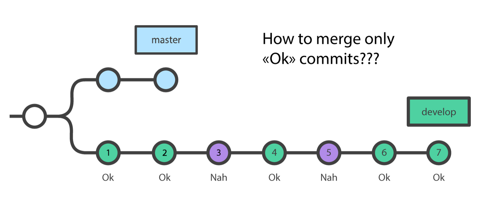

### git merge commit2
`git merge`でcommit2を指定するパターン。
git mergeではブランチではなくrevision (commit)で取り込む事が可能。ただしその場合次のようにcommit2の親であるcommit1までも取り込んでしまう


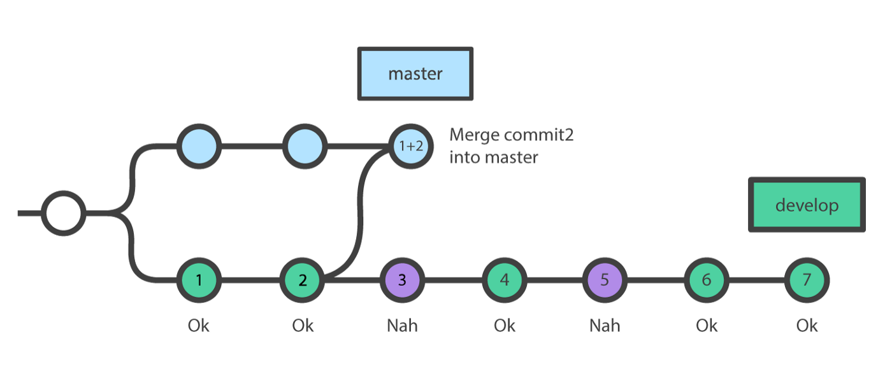

### git cherry-pick commit4

cherry-pickで必要なcommit4だけをマージする

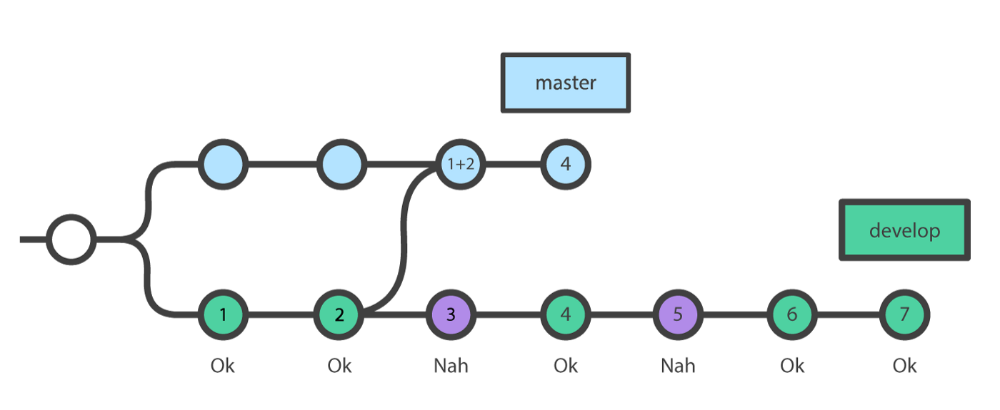

### git cherry-pick commit5 commit6 commit7

cherry-pickで複数commit指定してマージする

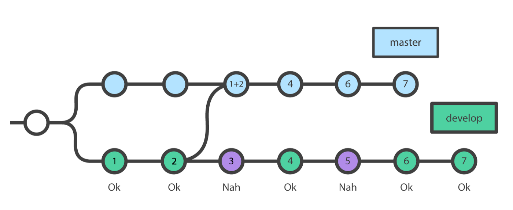


### テスト準備

mainブランチから`cherry-dev`ブランチを作成して、テスト用コミット(c0〜c4)を実行

```bash
git checkout main
git checkout -b cherry-dev

echo "add test" >> cherry0.md && git add cherry0.md && git commit -m "c0"
echo "add test" >> cherry1.md && git add cherry1.md && git commit -m "c1"
echo "add test" >> cherry2.md && git add cherry2.md && git commit -m "c2"
echo "add test" >> cherry3.md && git add cherry3.md && git commit -m "c3"
echo "add test" >> cherry4.md && git add cherry4.md && git commit -m "c4"
```

mainブランチに戻り、mainブランチからcherry-mainブランチを作成

```bash
git checkout main
git checkout -b cherry-main

# ログの確認
git l

* 71eef9e (cherry-dev) c4 - Yoichi Kawasaki, 50 seconds ago
* fcf29b8 c3 - Yoichi Kawasaki, 54 seconds ago
* 466cecb c2 - Yoichi Kawasaki, 56 seconds ago
* 33953c0 c1 - Yoichi Kawasaki, 59 seconds ago
* 6baee64 c0 - Yoichi Kawasaki, 68 seconds ago
```

### git mergeテスト (cherry-pickとの動きの比較のための実施)

`git merge`をつかって コミットc0とc1を`cherry-main`ブランチにmergeする。

```bash
git merge 33953c0  # c1のcommit

git l
* 71eef9e (cherry-dev) c4 - Yoichi Kawasaki, 2 minutes ago
* fcf29b8 c3 - Yoichi Kawasaki, 2 minutes ago
* 466cecb c2 - Yoichi Kawasaki, 2 minutes ago
* 33953c0 (HEAD -> cherry-main) c1 - Yoichi Kawasaki, 2 minutes ago
* 6baee64 c0 - Yoichi Kawasaki, 2 minutes ago

ls -1 cherry*
cherry0.md
cherry1.md
```
`git merge <c1 commit>`なのに、c1の親のc0もマージされていることがポイント。これがgit mergeの動き

次に、コミットc3を`cherry-main`ブランチにmergeする。 コミットc3を指定すると、その親であるc2,c1,c0もmergeされる。

```
git merge fcf29b8 # c3のcommit 

git l
* 71eef9e (cherry-dev) c4 - Yoichi Kawasaki, 3 minutes ago
* fcf29b8 (HEAD -> cherry-main) c3 - Yoichi Kawasaki, 3 minutes ago
* 466cecb c2 - Yoichi Kawasaki, 3 minutes ago
* 33953c0 c1 - Yoichi Kawasaki, 3 minutes ago
* 6baee64 c0 - Yoichi Kawasaki, 3 minutes ago

ls -1 cherry*
cherry0.md
cherry1.md
cherry2.md
cherry3.md
```

次に、git resetのおさらいを兼ねて、今のgit merge コミットc3を元に戻してみる

```bash
git reflog
fcf29b8 (HEAD -> cherry-main) HEAD@{0}: merge fcf29b8: Fast-forward
33953c0 HEAD@{1}: merge 33953c0: Fast-forward <<<<<<<<<<<<<<<<<<<<< ここ
3cc58f0 (main) HEAD@{2}: checkout: moving from main to cherry-main

# ここでc1をmergeしたところまでもどる
git reset --hard 33953c0

git l
* 71eef9e (cherry-dev) c4 - Yoichi Kawasaki, 5 minutes ago
* fcf29b8 c3 - Yoichi Kawasaki, 5 minutes ago
* 466cecb c2 - Yoichi Kawasaki, 5 minutes ago
* 33953c0 (HEAD -> cherry-main) c1 - Yoichi Kawasaki, 5 minutes ago
* 6baee64 c0 - Yoichi Kawasaki, 5 minutes ago

ls -1 cherry*
cherry0.md
cherry1.md
```

### git cherry-pick テスト

コミットc3だけを取り込むためにcherry-pickを使う。

下記のようにcherry-pickでコミットc3を指定する
```
git cherry-pick fcf29b8    # c3のcommit ID

# c3だけが取り込まれていることがわかる
git l
* 211b172 (HEAD -> cherry-main) c3 - Yoichi Kawasaki, 8 minutes ago
| * 71eef9e (cherry-dev) c4 - Yoichi Kawasaki, 8 minutes ago
| * fcf29b8 c3 - Yoichi Kawasaki, 8 minutes ago
| * 466cecb c2 - Yoichi Kawasaki, 8 minutes ago
|/
* 33953c0 c1 - Yoichi Kawasaki, 8 minutes ago
* 6baee64 c0 - Yoichi Kawasaki, 8 minutes ago

ls -1 cherry*
cherry0.md
cherry1.md
cherry3.md
```

### GitHubで演習 

1. cherry-devブランチをpushして、PR (cherry-dev -> main)を作成
2. PRをマージ
3. 新たにPR (main -> release)を作成.
  ただし、ここで全てのcommitをマージすると問題があると仮定する。c1+c3だけ先にマージしたい
4. releaseブランチからrelease-hotfixというなのhotfixブランチを作成
5. release-hotfixでc1+c3をcherry-pickしてorigin push
6. PR (release-hotfix -> release) のPRを作成 
7. PRをマージ


## Subtree
### add subtree

取り込みたいリポジトリを、外部リポジトリに登録する

```
SUBTREE_NAME=github-sandbox
git remote add $SUBTREE_NAME git@github.com:yokawasa/github-sandbox.git

```

外部リポジトリに登録したものをサブディレクトリに登録する

```
SUBTREE_NAME=github-sandbox
git subtree add --prefix=${SUBTREE_NAME} --squash ${SUBTREE_NAME} main
```

### pull subtree

```
SUBTREE_NAME=github-sandbox
git subtree pull --prefix=${SUBTREE_NAME} --squash ${SUBTREE_NAME} main
```

